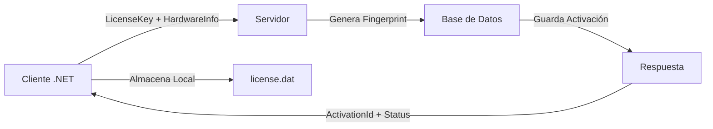
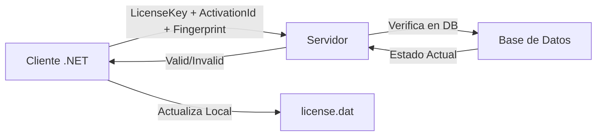

# Flujo Completo de Gestión de Licencias - WincajaLicenseManager

## 📋 Resumen Ejecutivo

El sistema de gestión de licencias de Wincaja implementa un flujo completo de activación, validación y desactivación de licencias con vinculación de hardware. Este documento describe el flujo completo probado y funcionando correctamente.

## ✅ Flujo Completo Exitoso

### 1. **Generación de Licencia** (Dashboard Web)
- Se genera la licencia desde el panel de administración web
- Ejemplo: `SQCN-92ZZ-AJI2-6WS8-7CM5`
- La licencia incluye:
  - Límite de activaciones (ej: 10 dispositivos)
  - Fecha de expiración
  - Características habilitadas
  - Firma digital RSA

### 2. **Activación vía Cliente .NET**
```bash
# Activación por línea de comandos
.\TestConsole.exe 'SQCN-92ZZ-AJI2-6WS8-7CM5'
```
- **Resultado**: Licencia activada exitosamente
- Se genera un fingerprint de hardware único (16 caracteres)
- Se almacena localmente de forma encriptada
- La activación es **idempotente** (puede ejecutarse múltiples veces sin problemas)

### 3. **Validación de Licencia**
```bash
# Forzar validación en línea
.\TestConsole.exe --force-validate
```
- **Estado**: `"status": "active"`
- **Válida**: `"valid": true`
- Días hasta expiración: 121
- Hardware validado correctamente

### 4. **Desactivación desde Dashboard**
- Administrador desactiva la licencia desde el panel web
- Se elimina el registro de activación en el servidor
- El contador de activaciones se decrementa

### 5. **Validación Post-Desactivación**
```bash
# La validación forzada muestra la licencia como inválida
.\TestConsole.exe --force-validate
```
- **Estado**: `"status": "invalid"`
- **Válida**: `"valid": false`
- **Razón**: "Activation not found for this license"
- La licencia local se marca como inválida

### 6. **Reactivación Exitosa**
```bash
# Se puede reactivar la misma licencia
.\TestConsole.exe 'SQCN-92ZZ-AJI2-6WS8-7CM5'
```
- La licencia se reactiva en el mismo hardware
- Vuelve a estar activa y válida

## 🔧 Componentes del Sistema

### Cliente .NET (`wincaja-license-client-dotnet`)

#### Estructura del Proyecto
```
wincaja-license-client-dotnet/
├── WincajaLicenseManager/          # Biblioteca principal
│   ├── Core/
│   │   ├── ApiClient.cs            # Comunicación con servidor
│   │   ├── HardwareFingerprinter.cs # Generación de fingerprint
│   │   ├── LicenseValidator.cs     # Lógica de validación
│   │   └── SecureStorage.cs        # Almacenamiento encriptado
│   ├── Models/
│   │   └── LicenseModels.cs        # Modelos de datos
│   └── IWincajaLicenseManager.cs   # Interfaz pública
└── TestConsole/                     # Aplicación de prueba
    └── Program.cs                   # Consola interactiva
```

#### Características Principales

1. **Almacenamiento Seguro**
   - Ubicación: `%APPDATA%\Wincaja\license.dat`
   - Encriptación basada en datos de la máquina
   - Protección contra manipulación

2. **Fingerprint de Hardware**
   - Genera un hash SHA-256 del hardware
   - El servidor trunca a 16 caracteres para flexibilidad
   - Componentes incluidos:
     - CPU (modelo, cores)
     - Red (interfaces MAC)
     - Discos (seriales)
     - Placa base
     - BIOS
     - UUID del sistema

3. **Validación con Período de Gracia**
   - Validación local cuando está dentro del período de gracia (7 días)
   - Validación en línea obligatoria cuando expira el período
   - Opción de forzar validación en línea inmediata

### Servidor (Remix - `wincaja-licencias`)

#### Endpoints API Principales

1. **`POST /api/licenses/activate`**
   - Activa una licencia en un dispositivo
   - Verifica límites de activación
   - Genera fingerprint flexible (16 caracteres)
   - Soporta tolerancia a cambios de hardware

2. **`POST /api/licenses/validate`**
   - Valida una licencia activa
   - Verifica:
     - Firma digital (omitida en desarrollo)
     - Estado de la licencia
     - Vinculación de hardware
     - Fecha de expiración
   - Retorna información completa de validación

3. **`POST /api/licenses/deactivate`**
   - Desactiva una licencia específica
   - Requiere autenticación
   - Libera el slot de activación

## 📊 Flujo de Datos

### Activación


### Validación


## 🔐 Seguridad

### Cliente
- **Encriptación AES** del archivo de licencia local
- **Clave derivada** de información única de la máquina
- **Protección** contra copia del archivo a otra máquina

### Servidor
- **Firma RSA-SHA256** de las licencias (producción)
- **Verificación de fingerprint** en cada validación
- **Logs de auditoría** de todas las operaciones

### Comunicación
- **HTTPS** en producción (HTTP en desarrollo local)
- **Idempotencia** en activación (evita duplicados)
- **Manejo de errores** robusto

## 💻 Uso del Cliente .NET

### Instalación
```bash
# Compilar el proyecto
cd TestConsole
dotnet build
```

### Modos de Uso

#### 1. Línea de Comandos
```bash
# Activar licencia
.\TestConsole.exe 'XXXX-XXXX-XXXX-XXXX-XXXX'

# Forzar validación en línea
.\TestConsole.exe --force-validate
```

#### 2. Modo Interactivo
```bash
.\TestConsole.exe

Opciones:
1. Get Hardware Fingerprint
2. Activate License
3. Validate License
4. Get License Status
5. Deactivate License
6. Force Online Validation
7. Exit
```

### Integración en Aplicaciones

```csharp
using WincajaLicenseManager;

// Crear instancia del manager
IWincajaLicenseManager licenseManager = new WincajaLicenseManagerImpl();

// Activar licencia
string result = licenseManager.ActivateLicense("XXXX-XXXX-XXXX-XXXX-XXXX");

// Validar licencia
string validationResult = licenseManager.ValidateLicense();

// Forzar validación en línea
string forceValidation = licenseManager.ValidateLicenseForceOnline();

// Desactivar licencia
string deactivateResult = licenseManager.DeactivateLicense();
```

## 🔄 Estados de Licencia

| Estado | Descripción | Acción Requerida |
|--------|-------------|------------------|
| `active` | Licencia válida y activa | Ninguna |
| `invalid` | Licencia inválida o desactivada | Reactivar o contactar soporte |
| `expired` | Licencia expirada | Renovar licencia |
| `hardware_mismatch` | Hardware no coincide | Reactivar en nuevo hardware |
| `not_activated` | No hay licencia local | Activar licencia |

## 🛠️ Configuración

### Cliente
```csharp
// Cambiar URL del servidor (por defecto: http://localhost:5173)
var apiClient = new ApiClient("https://licencias.wincaja.mx/api/licenses");
```

### Servidor
```env
# Variables de entorno
RSA_KEYS_PATH=.keys
DATABASE_URL=postgresql://...
```

## 📝 Logs y Depuración

### Cliente
- Los logs de debug se muestran en consola con `[DEBUG]`
- Información sensible se enmascara (ej: `SQCN****************7CM5`)

### Servidor
- Logs estructurados con niveles: INFO, WARN, ERROR
- Información de hardware y validación para auditoría
- IDs de request para trazabilidad

## ⚠️ Consideraciones Importantes

1. **Desarrollo vs Producción**
   - En desarrollo: Se omite verificación de firma RSA si no hay claves
   - En producción: Verificación de firma obligatoria

2. **Tolerancia a Cambios de Hardware**
   - Modo `flexible`: Permite hasta 2 componentes cambiados
   - Modo `strict`: No permite cambios
   - Modo `tolerant`: Permite cambios significativos (50% similitud)

3. **Período de Gracia**
   - Por defecto: 7 días sin validación en línea
   - Configurable por licencia
   - Se puede forzar validación inmediata

## 🚀 Mejoras Futuras

1. **Gestión de Claves RSA**
   - Implementar rotación automática de claves
   - Backup seguro de claves privadas

2. **Métricas y Análisis**
   - Dashboard de uso de licencias
   - Alertas de activaciones sospechosas

3. **Soporte Offline Extendido**
   - Códigos de activación offline
   - Validación por archivo

## 📞 Soporte

Para problemas con el sistema de licencias:
1. Verificar conectividad con el servidor
2. Revisar logs del cliente (`[DEBUG]` messages)
3. Verificar estado en dashboard de administración
4. Contactar soporte técnico con el ID de licencia 